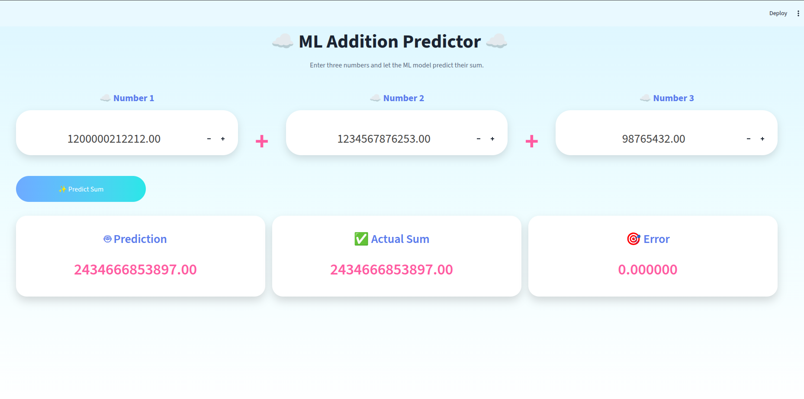

# ☁️ ML Addition Predictor using Multiple Linear Regression

<p align="center">
  
</p>


<p align="center">

🚀 <b>Live Demo:</b> https://smart-add-6ypw.onrender.com

</p>

## 📖 About the Project

This project demonstrates how **Multiple Linear Regression** can learn the mathematical relationship between three input numbers and predict their sum.

Although adding numbers is a simple mathematical operation, the purpose of this project is to understand the **complete Machine Learning workflow**—from data preparation to model deployment.

The trained model is integrated into a **Streamlit web application** with a cloud-themed user interface where users can enter three numbers and receive the predicted sum along with the actual sum and prediction error.

---

## ✨ Features

- 🔮 Predicts the sum of three numbers using Machine Learning
- ☁️ Beautiful Cloud-themed Streamlit Interface
- 📟 Displays:
  - 🤖 ML Prediction
  - ✅ Actual Sum
  - 🎯 Prediction Error
- ⚡ Fast and interactive UI
- 🌍 Fully deployed using Render

---

## 🧠 Machine Learning Workflow

This project follows the complete Machine Learning pipeline:

- 📄 Generated a custom dataset
- 📚 Loaded the dataset using **Pandas**
- 🔍 Performed basic **Exploratory Data Analysis (EDA)**
- ✂️ Split the dataset into **Training** and **Testing** sets
- 🏋️ Implemented **Multiple Linear Regression from scratch** (custom `MyLR` class using the Normal Equation instead of scikit-learn's `LinearRegression`)
- 📈 Evaluated the model using:
  - 📉 Mean Absolute Error (MAE)
  - 📉 Root Mean Square Error (RMSE)
  - ⭐ R² Score
- 💾 Saved the trained model using **Pickle**
- 🌊 Built an interactive **Streamlit** web application
- 📥 Loaded the saved model for prediction
- ⌨️ Accepted user input from the UI
- ⏱️ Predicted the output in real time
- 🚀 Deployed the application online

---

## 🛠️ Tech Stack

- 🐍 Python
- 🔢 NumPy
- 📊 Pandas
- 🤖 Scikit-learn (for evaluation metrics only)
- 🥒 Pickle
- 🌊 Streamlit
- 🌐 HTML
- 🎨 CSS

---

## 📁 Project Structure

```text
ML_Addition_Predictor/
│
├── add_app.py                 # Streamlit web application
├── my_lr.py                   # Custom Linear Regression implementation
├── model.pkl                  # Trained model (pickled MyLR instance)
├── generate_dataset.py        # Dataset generation script
├── generated_dataset_add.csv  # Generated dataset
├── Addition_prediction.ipynb  # Jupyter notebook for training & EDA
├── style.css                  # UI styling
├── requirements.txt           # Python dependencies
├── output.png                 # Project screenshot
├── README.md
└── .streamlit/
    └── config.toml
```

---

## 📊 Model Performance

| Metric | Value |
|---------|--------|
| Mean Absolute Error (MAE) | *1.42* |
| Root Mean Square Error (RMSE) | *1.8* |
| R² Score | *1.0* |

---

## 🚀 How to Run Locally
streamlit run add_app.py

### Clone the repository

```bash
git clone https://github.com/varshasharma01/ML_Addition_Predictor.git
```

### Navigate to the project

```bash
cd ML_Addition_Predictor
```

### Install dependencies

```bash
pip install -r requirements.txt
```

### Run the application

```bash
streamlit run add_app.py
```

---

## 🔮 Future Improvements

- ☁️ Cloud-shaped custom input fields
- 🎬 Animated UI
- 🌙 Dark mode support
- 📊 Addition of model visualization
- ➕ Support for more mathematical operations

---

## 👩‍💻 Author

**Varsha Sharma**

GitHub: https://github.com/varshasharma01
LinkedIn: https://www.linkedin.com/in/varsha-sharma-41004b228/